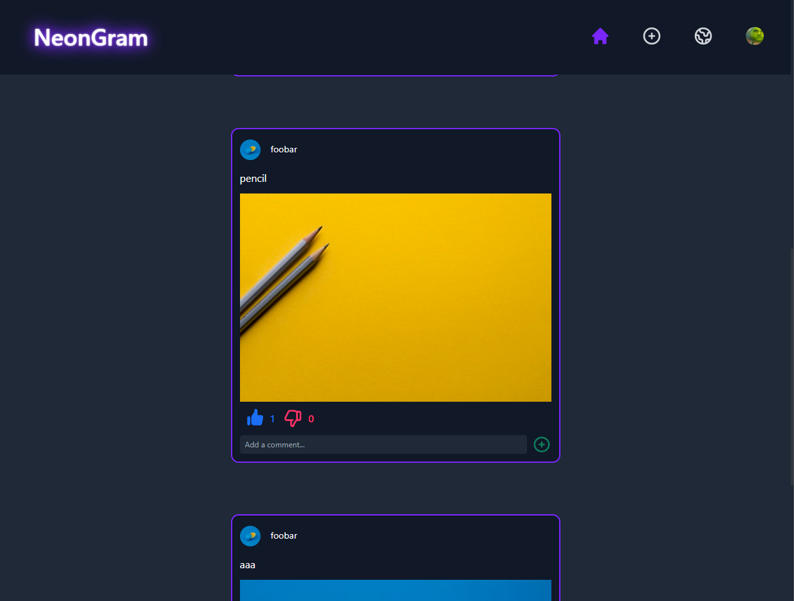
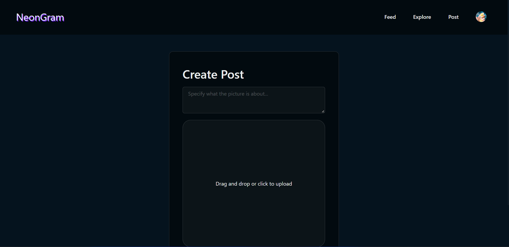
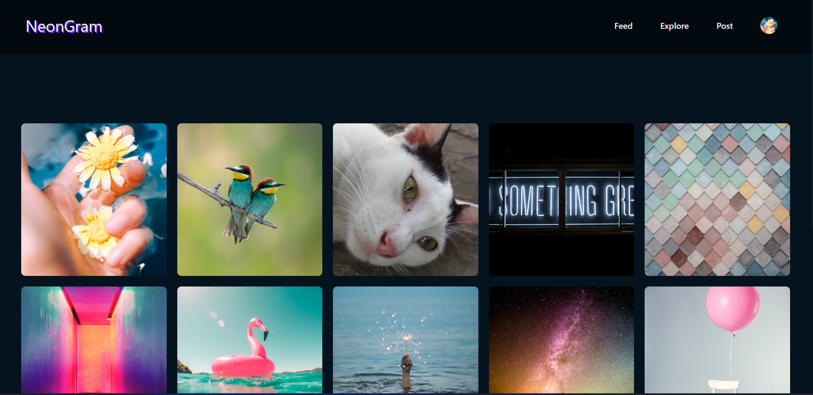
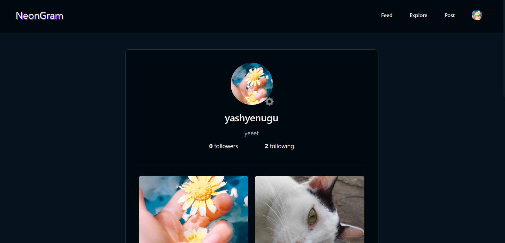
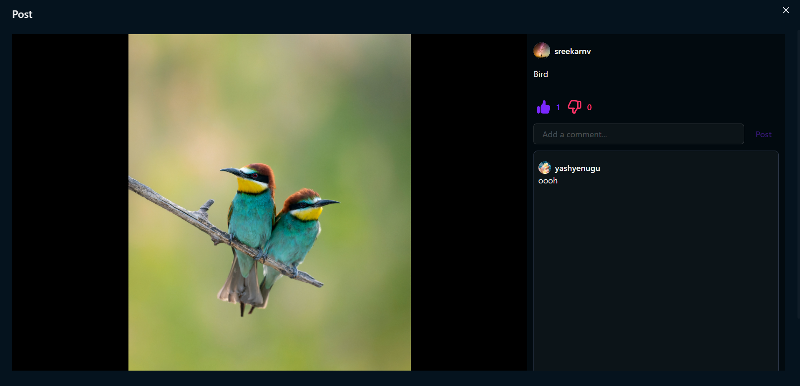
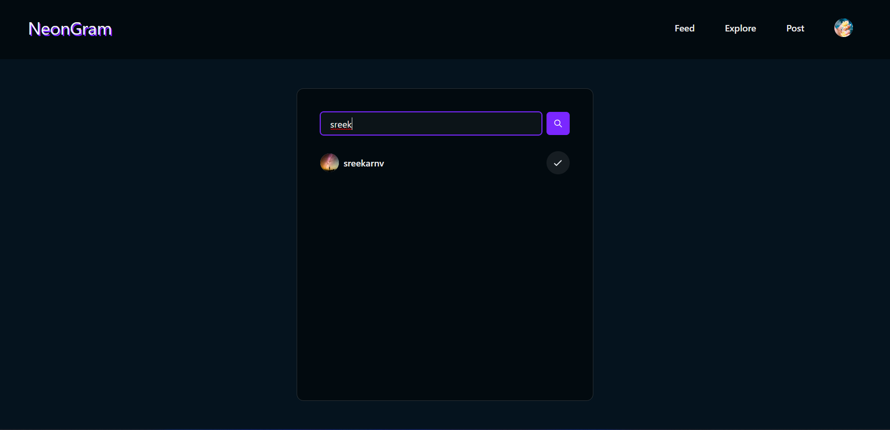
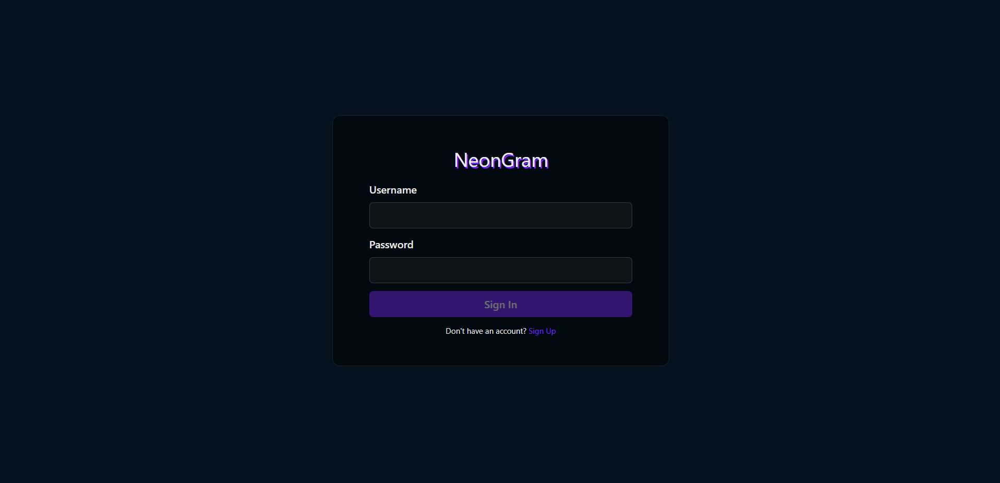
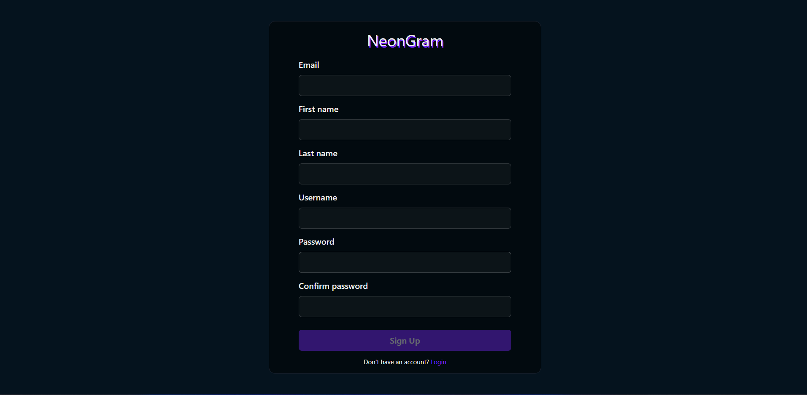

# NeonGram

It's an instagram inspired social media application built using MERN stack.  
Hosted at: https://neongram.netlify.app/.

# Tech Used

1. [React](https://reactjs.org/)
2. [Chakra ui](https://chakra-ui.com/)
3. [Express](https://expressjs.com/)
4. [MongoDB](https://mongodb.com/)
5. [Cloudinary](https://cloudinary.com/)
6. [Formik](https://formik.org/)
7. [JWT](https://jwt.io/)

## Features
#### Feed

#### Create post

#### Explore Feed

#### User Profile

#### Post Modal

#### Find users

#### Login

#### Signup
